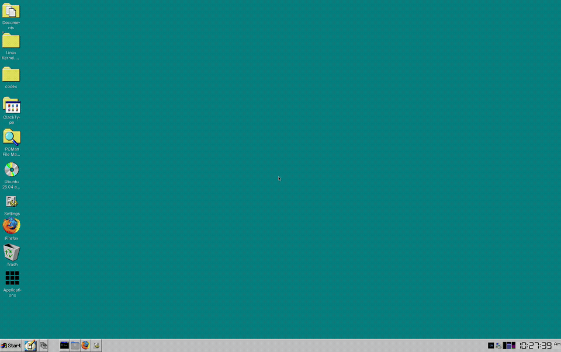
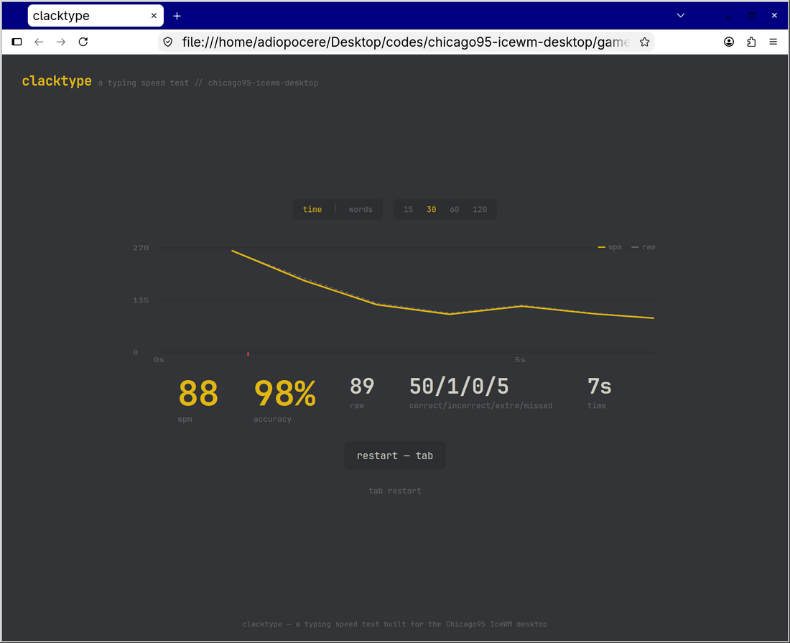

# Chicago95 IceWM Desktop

[](https://github.com/gegestalt/chicago95-icewm-desktop/actions/workflows/lint.yml)
[](https://github.com/gegestalt/chicago95-icewm-desktop/releases)

See [CHANGELOG.md](CHANGELOG.md) for release notes.

A Windows-95/XP-styled IceWM desktop for Ubuntu, built on top of the
[Chicago95](https://github.com/grassmunk/Chicago95) GTK/icon theme. This repo
is the post-install layer: a proper Start menu, a real "all apps" grid like
Ubuntu's app grid or macOS Launchpad, HiDPI-correct window chrome, and every
default app wired to something that actually matches the theme instead of
falling back to stock GNOME apps.



## Technology stack

- **Window manager:** [IceWM](https://ice-wm.org/)
- **Theme:** [Chicago95](https://github.com/grassmunk/Chicago95) (GTK + icon theme)
- **Terminal:** [Ghostty](https://ghostty.org/) — wired in as `TerminalCommand`
  and the Start menu/taskbar launcher
- **File manager:** `pcmanfm`
- **Settings manager:** `xfce4-settings-manager` (GTK3, themable — unlike GNOME
  Control Center)
- **Notifications:** `dunst`
- **Network applet:** `network-manager-gnome` (`nm-applet`)
- **Image/document/media viewers:** `gpicview`, `evince`, `mpv`
- **Display manager:** LightDM, themed to match
- **Boot splash:** Plymouth, running the vendored Chicago95 boot animation
- **Browser:** Firefox (`.deb`, not snap — see [What it doesn't
  do](#what-it-doesnt-do))
- **Install/uninstall tooling:** POSIX `sh`, no build step, no external
  dependencies beyond `apt`

## What it does

- **Start menu** with every installed app, auto-generated and grouped by
  category (`icewm-menu-fdo`), plus quick-launch shortcuts on top.
- **A taskbar "Applications" button** (3x3 grid icon, matching Ubuntu's app-grid glyph) that opens `~/Applications`
  — a flat, one-page, alphabetized grid of *every* installed app, no category
  folders. Kept in sync automatically on every login.
- **HiDPI-correct window chrome.** The stock Chicago95 IceWM theme's title-bar
  buttons and borders are raw pixel-art sized for ~96 DPI screens; on a
  HiDPI display they render tiny inside an enlarged bar. This repo ships a
  proper 2x-upscaled asset set (`dotfiles/icewm/themes-2x`) alongside the
  original (`themes-1x`), and the installer picks the right one by measuring
  your actual display DPI.
- **Theme-consistent default apps** — `gpicview`/`evince`/`mpv`/`pcmanfm`
  instead of GNOME's GTK4 Loupe/Showtime/Nautilus (which cannot be reskinned
  by any classic GTK theme), and `xfce4-settings-manager` (themable, GTK3)
  instead of GNOME Control Center (GTK4/libadwaita, also unreskinnable).
- **GSettings synced** to the theme so GTK4/portal-aware apps stop falling
  back to Yaru/Adwaita.
- **LightDM greeter** configured for Chicago95 with the correct DPI.
- **A Plymouth boot theme** — a 20-frame Windows-95-style boot animation,
  installed to `/usr/share/plymouth/themes/Chicago95` and set as default.
  Vendored from upstream Chicago95 (see [ATTRIBUTION.md](ATTRIBUTION.md)),
  which ships it but doesn't wire it up itself. Takes effect on next
  reboot — `install.sh` stages it, it doesn't reboot you.
- **The Windows-95 login/logout chime, actually audible.** Vendored from
  upstream Chicago95 (see [ATTRIBUTION.md](ATTRIBUTION.md)) as a full XDG
  sound theme, and wired into IceWM's own sound daemon (`icesound`) for
  startup, shutdown, restart, and dialog-open/close — not just files
  sitting in a theme folder that nothing ever plays. GSettings also points
  GTK4/portal apps at the same theme.
- **A game: ClackType.** `games/clacktype` — a from-scratch typing-speed
  test in the same vein as Monkeytype (word-by-word correct/incorrect
  highlighting, live WPM/accuracy, time and word-count modes, and a
  results-screen WPM/raw graph with error ticks). Single self-contained
  HTML file, no build step, no network dependency, runs in Firefox. Lands
  on the Start menu and Desktop as "ClackType."

  

## What it doesn't do

GNOME Settings, Nautilus, and other libadwaita apps genuinely cannot be
reskinned — that's a GTK4 design decision, not something a theme or this
script can work around. This repo replaces them with themable equivalents
instead of trying to force them.

Firefox as a **snap** is sandboxed away from any custom theme entirely (it
can only see the themes bundled in the `gtk-common-themes` snap) — that's
handled by the separate, opt-in `optional/migrate-firefox-to-deb.sh`, not by
`install.sh`, since it removes a package and touches your browser profile.

## Prerequisites

- Ubuntu (apt-based)
- [Ghostty](https://ghostty.org/) installed (`apt install ghostty` on recent
  Ubuntu; see ghostty.org for other distros/versions) — it's the default
  terminal this repo wires up, and `install.sh` doesn't install it for you
- The upstream Chicago95 theme already installed:
  ```
  git clone https://github.com/grassmunk/Chicago95.git ~/Chicago95
  cd ~/Chicago95 && python3 installer.py
  ```

## Install

```
git clone https://github.com/gegestalt/chicago95-icewm-desktop.git
cd chicago95-icewm-desktop
./install.sh
```

Log out and pick the **IceWM Chicago95** session at the login screen.

Optional, recommended if Firefox is installed as a snap:
```
./optional/migrate-firefox-to-deb.sh
```

## Uninstall

Every file `install.sh` overwrites is backed up first, and every GSettings
key it changes has its previous value recorded, under
`~/.chicago95-icewm-desktop/backups/<run>/`. To revert the most recent run:

```
./uninstall.sh
```

This restores anything that already existed, deletes anything that was newly
created, and restores the old GSettings values. It leaves the `~/Applications`
grid folder and any packages `install.sh` installed via apt in place — those
are harmless to keep around, and removing packages automatically felt like
the wrong default. Pass a specific run id (a timestamp directory name under
`backups/`) to revert an older run instead of the latest one.

## Layout

```
install.sh                        main installer (idempotent, DPI-aware, self-backing-up)
uninstall.sh                      reverts a previous install.sh run
optional/migrate-firefox-to-deb.sh  snap -> .deb Firefox migration (opt-in)
dotfiles/icewm/                   menu, toolbar, preferences, theme assets (1x + 2x)
dotfiles/config/                  gtk-3.0, gtk-4.0, mimeapps.list, dunst
dotfiles/local/bin/build-app-grid script that (re)builds ~/Applications
icons/chicago95-applications/     the taskbar "Applications" icon, all sizes
games/clacktype/                  self-contained typing-test game (no deps)
system/plymouth/Chicago95/        boot theme (vendored, see ATTRIBUTION.md)
system/sounds/Chicago95/          full sound theme (vendored, see ATTRIBUTION.md)
system/                           lightdm + xsessions entries (sudo-installed)
.github/workflows/lint.yml        CI: bash -n + ShellCheck on every push/PR
```

## License

MIT for everything in this repo. Chicago95 itself is a separate project —
see its own repo for its license.
