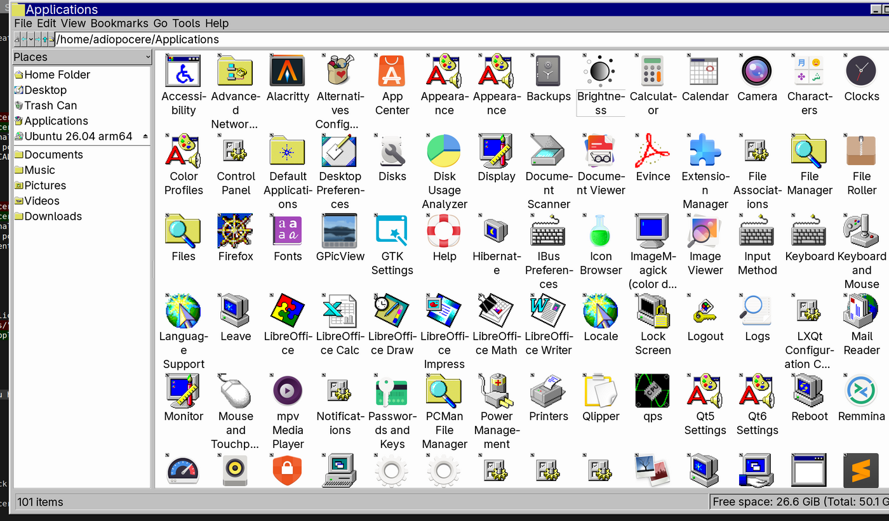

# Chicago95 IceWM Desktop

A Windows-95/XP-styled IceWM desktop for Ubuntu, built on top of the
[Chicago95](https://github.com/grassmunk/Chicago95) GTK/icon theme. This repo
is the post-install layer: a proper Start menu, a real "all apps" grid like
Ubuntu's app grid or macOS Launchpad, HiDPI-correct window chrome, and every
default app wired to something that actually matches the theme instead of
falling back to stock GNOME apps.



## What it does

- **Start menu** with every installed app, auto-generated and grouped by
  category (`icewm-menu-fdo`), plus quick-launch shortcuts on top.
- **A taskbar "Applications" button** (six-square grid icon) that opens `~/Applications`
  — a flat, one-page, alphabetized grid of *every* installed app, no category
  folders. Kept in sync automatically on every login.
- **HiDPI-correct window chrome.** The stock Chicago95 IceWM theme's title-bar
  buttons and borders are raw pixel-art sized for ~96 DPI screens; on a
  HiDPI display they render tiny inside an enlarged bar. This repo ships a
  proper 2x-upscaled asset set (`dotfiles/icewm/themes-2x`) alongside the
  original (`themes-1x`), and the installer picks the right one by measuring
  your actual display DPI.
- **Theme-consistent default apps** — `gpicview`/`evince`/`mpv`/`pcmanfm`
  instead of GNOME's GTK4 Loupe/Showtime/Nautilus (which cannot be reskinned
  by any classic GTK theme), and `xfce4-settings-manager` (themable, GTK3)
  instead of GNOME Control Center (GTK4/libadwaita, also unreskinnable).
- **GSettings synced** to the theme so GTK4/portal-aware apps stop falling
  back to Yaru/Adwaita.
- **LightDM greeter** configured for Chicago95 with the correct DPI.

## What it doesn't do

GNOME Settings, Nautilus, and other libadwaita apps genuinely cannot be
reskinned — that's a GTK4 design decision, not something a theme or this
script can work around. This repo replaces them with themable equivalents
instead of trying to force them.

Firefox as a **snap** is sandboxed away from any custom theme entirely (it
can only see the themes bundled in the `gtk-common-themes` snap) — that's
handled by the separate, opt-in `optional/migrate-firefox-to-deb.sh`, not by
`install.sh`, since it removes a package and touches your browser profile.

## Prerequisites

- Ubuntu (apt-based)
- The upstream Chicago95 theme already installed:
  ```
  git clone https://github.com/grassmunk/Chicago95.git ~/Chicago95
  cd ~/Chicago95 && python3 installer.py
  ```

## Install

```
git clone https://github.com/gegestalt/chicago95-icewm-desktop.git
cd chicago95-icewm-desktop
./install.sh
```

Log out and pick the **IceWM Chicago95** session at the login screen.

Optional, recommended if Firefox is installed as a snap:
```
./optional/migrate-firefox-to-deb.sh
```

## Layout

```
install.sh                        main installer (idempotent, DPI-aware)
optional/migrate-firefox-to-deb.sh  snap -> .deb Firefox migration (opt-in)
dotfiles/icewm/                   menu, toolbar, preferences, theme assets (1x + 2x)
dotfiles/config/                  gtk-3.0, gtk-4.0, mimeapps.list, dunst
dotfiles/local/bin/build-app-grid script that (re)builds ~/Applications
icons/chicago95-applications/     the taskbar "Applications" icon, all sizes
system/                           lightdm + xsessions entries (sudo-installed)
```

## License

MIT for everything in this repo. Chicago95 itself is a separate project —
see its own repo for its license.
